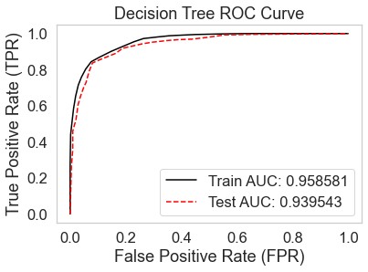

# Twitter Bot Detection


A machine-learning project that classifies a Twitter account as **bot** or **human** from its
public profile attributes. Four scikit-learn classifiers are compared in an analysis notebook; the
best (a Decision Tree) is trained, pickled, and served through a small Flask web form.

> **Academic team project.** Built as a college course (EDI) group project — not solo work. The
> repository has been cleaned up and restructured for clarity and reproducibility.

## Features

- Exploratory data analysis with missing-value, imbalance and Spearman-correlation checks.
- Feature engineering: keyword/lexicon binary flags over the screen name, name, description and
  status, plus numeric profile signals (followers, friends, statuses, listed count, verified).
- Comparison of four classifiers — Decision Tree, Random Forest, Multinomial Naive Bayes and SVM —
  with accuracy/precision/recall/F1 and ROC curves.
- A trained Decision Tree persisted to `model.pkl`.
- A Flask web app that takes feature values via a form and returns a Bot/Human prediction.

## Tech Stack

- **Python 3**
- **pandas / NumPy** — data handling and feature engineering
- **scikit-learn** — Decision Tree, Random Forest, Multinomial NB, SVC, metrics
- **matplotlib / seaborn** — EDA plots and ROC curves
- **Flask** — web app serving the trained model

## Dataset

Uses a **public Twitter bot dataset** (`data/training_data_2_csv_UTF.csv`, ~2,800 labelled
accounts; a separate `test_data_4_students.csv` is included). The data was **not collected** as part
of this project — it is a pre-existing public dataset.

## How It Works

1. **EDA & feature engineering** (`notebooks/twitter_bot_detection.ipynb`): inspect the data, build
   keyword/lexicon binary flags and numeric features.
2. **Model comparison**: train/test split (70/30, `random_state=101`) across four classifiers.
3. **Model selection**: the Decision Tree gives the best held-out accuracy and is chosen.
4. **Training & export** (`model.py`): fit the Decision Tree on the dataset and pickle it to
   `model.pkl`.
5. **Serving** (`app.py`): a Flask form collects feature values and returns a Bot/Human prediction.

## Results

Held-out test accuracy from the analysis notebook (70/30 split, `random_state=101`):

| Classifier               | Test Accuracy |
|--------------------------|:-------------:|
| **Decision Tree**        | **0.8786**    |
| Random Forest            | 0.8607        |
| Multinomial Naive Bayes  | 0.6976        |
| Support Vector Machine   | 0.5369        |

The Decision Tree was selected. (SVM reached 0.9964 training accuracy but only 0.5369 on test data —
a clear case of overfitting.)

ROC curve for the selected Decision Tree:



## Prerequisites

- Python 3.8+
- Dependencies in `requirements.txt`

## Installation

```bash
git clone https://github.com/archiskhuspe/twitter-bot-detection.git
cd twitter-bot-detection
pip install -r requirements.txt
```

## Usage

A pre-trained `model.pkl` is included, so you can run the web app directly:

```bash
python app.py            # serves on http://127.0.0.1:5000/
```

To retrain the model from the dataset (regenerates `model.pkl`):

```bash
python model.py
```

To explore the analysis, open `notebooks/twitter_bot_detection.ipynb` (run it from the `notebooks/`
folder so the relative `../data/...` path resolves).

## Project Structure

```
twitter-bot-detection/
├── app.py                              # Flask web app (loads model.pkl)
├── model.py                            # Trains the Decision Tree and pickles it
├── model.pkl                           # Pre-trained model
├── requirements.txt
├── templates/
│   └── index.html                      # Web form + visualisations page
├── static/                             # ROC curves & results image
│   ├── decisiontree.png
│   ├── multinomialnaivebayes.png
│   ├── randomforest.png
│   ├── svm.png
│   └── result.png
├── data/                               # Public Twitter bot dataset (CSV)
├── notebooks/
│   └── twitter_bot_detection.ipynb     # EDA, feature engineering, model comparison
└── docs/
    ├── Literature Review.xlsx
    └── Final.html                      # Static export of the analysis notebook
```

## Limitations

- **Academic/team project**, not solo or production work.
- Small dataset (~2,800 accounts), so results may not generalise to current Twitter/X activity.
- **Profile-only features** — no tweet content, network or temporal/behavioural signals.
- The keyword/lexicon list used for the binary flags is hand-built and dated.
- SVM is badly overfit (train 0.9964 / test 0.5369); only the Decision Tree is deployed.
- `model.pkl` (via `model.py`) is fit on the full dataset without a held-out split; the reported
  accuracies come from the notebook's 70/30 evaluation.
- The Flask app uses the development server and expects pre-encoded integer feature inputs — it is a
  demo, not a production service.

## License

Released under the [MIT License](LICENSE).
